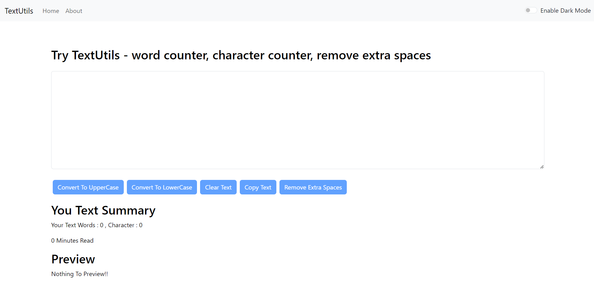
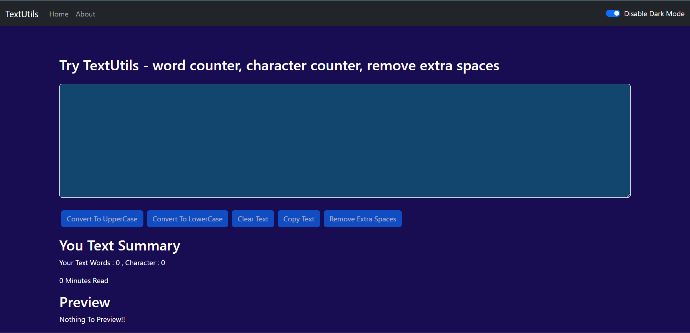

# TextUtils

TextUtils is a React-based web application that provides various text manipulation and analysis tools. With TextUtils, you can easily format, analyze, and preview text input.

## Features

- **Text Manipulation:**
  - Capitalize Text: Convert text to uppercase.
  - Lowercase Text: Convert text to lowercase.
  - Remove Extra Spaces: Eliminate extra spaces in the text.
  - Copy Text: Quickly copy the modified text to your clipboard.
  - Clear Text: Clear the text input field.

- **Text Analysis:**
  - Word Count: See the number of words in your text.
  - Character Count: Calculate the total character count.
  - Reading Time: Estimate the reading time of your text.
  
- **Preview Text:**
  - View a live preview of your formatted text.

- **About:**
  - Learn more about the TextUtils project.

- **Theme Switcher:**
  - Change between light and dark themes for a comfortable reading experience.

## Success Alerts

- **Uppercase Conversion:** When you use the "Capitalize Text" feature to convert text to uppercase, a success alert will be displayed to confirm that the operation was successful. You will see a message like "Text successfully converted to uppercase."

- **Lowercase Conversion:** Similarly, when you use the "Lowercase Text" feature to convert text to lowercase, a success alert will be displayed to confirm that the operation was successful. You will see a message like "Text successfully converted to lowercase."

- **Other Actions:** Success alerts are used for other actions as well, such as clearing the text field or removing extra spaces.

## Screenshots

### Light Theme

*Screenshot of TextUtils with Light Theme.*

### Dark Theme

*Screenshot of TextUtils with Dark Theme.*

## Built With

- React.js: A JavaScript library for building user interfaces.
- Functional Components and React Hooks.

## Getting Started

1. Clone this repository.
2. Navigate to the project directory.
3. Install dependencies with `npm install`.
4. Start the development server with `npm start`.

## Usage

1. Enter or paste your text in the input field.
2. Use the provided buttons to manipulate and analyze your text.
3. Preview the modified text.
4. Enjoy the convenience of text formatting and analysis!

## About

This project is an example of a simple React application created for educational and demonstration purposes. Feel free to use and modify it to suit your needs.

